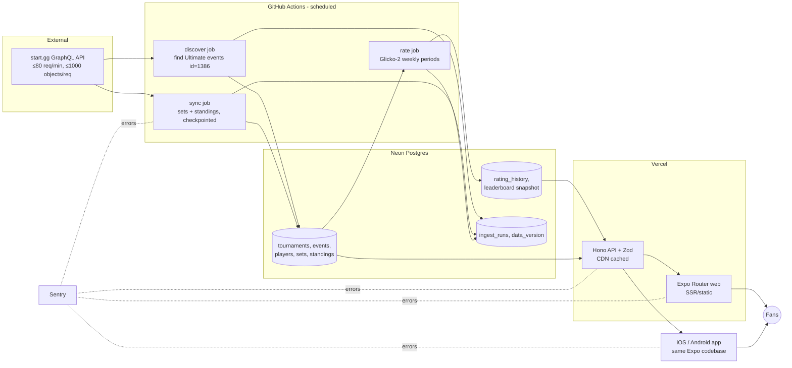

# Smash Rankings — Build Blueprint

**Owner:** Clay McCoy (product owner, not an engineer)
**Builder:** Claude Code (cloud sessions from the Claude phone app, working in a GitHub repo, with subagents in `.claude/agents/`)
**Goal:** A fast, good-looking web app with near-live Super Smash Bros. Ultimate player rankings. Built so it can ship to the iOS App Store and Google Play later without a rewrite. Running cost should stay around $0/month at hobby scale.
**Research date:** 2026-10-03. Every fact below has a source link (see [Sources](#sources)). Items marked **⚠ unverified** still need checking during Phase 0.

---

## Decisions locked (Oct 3, 2026, by Clay)

Clay accepted recommended defaults 1–7 in [§7 Decisions for Clay](#7-decisions-for-clay-plain-language-each-with-a-recommended-default) as-is. On Oct 3, 2026 he replaced default 8 (dark theme) with a white, light theme. See [Design principles](#design-principles). Later on Oct 3, 2026 he changed decision 2 and added decision 9: **launch Texas-only, counting events with 16+ entrants** (see [ADR-0003](adr/0003-texas-launch-scope.md)). Treat these as decided. Don't re-ask them unless Clay opens one back up.

1. **Public or private GitHub repo?** Public. Unlimited free automation minutes. The code is readable; secrets stay out of the repo.
2. **Which tournaments count? (changed Oct 3, 2026):** In-person singles events with **≥ 16 entrants**, so Texas locals and weeklies count. (Was: ≥ 64 entrants.)
3. **Online events?** In-person only. Online events are stored but not rated.
4. **Ranking style?** (a) Skill rating with **Glicko-2**, which updates after events and handles inactivity. A "this season" view is added in Phase 2.
5. **How far back?** **12 months** live at launch, with history backfilled to **24 months** later.
6. **How "live"?** Refresh every 2 hours, and hourly on tournament weekends (Friday–Monday). Stay at $0. Faster refresh is possible later but uses more of the start.gg request budget.
7. **Database: Neon or Supabase?** **Neon** Postgres (Free). It has more free storage and does not pause when idle.
8. **Name and look:** A neutral, non-Nintendo name (for example "Bracket Index"). Clay can pick the final name anytime before Phase 3. **Look (changed Oct 3, 2026):** white background, light theme, premium and specific. Not a dark theme. Rules are in [Design principles](#design-principles).
9. **Where? (added Oct 3, 2026):** **Texas only** at launch. Only events held in Texas are ingested and rated, so the leaderboard is Texas players. The region is a setting (`LAUNCH_REGIONS` in `packages/core`), not hard-coded, so more states can be added one at a time later. Goal: ship a Texas phone app first. A federation-rankings tab, user logins, and admin users come in the **next phase**, not now. Our Glicko-2 ranking stays the main ranking.

---

## Design principles

Set by Clay on Oct 3, 2026. This replaces the dark-theme default.

- **White and light.** White background. No dark theme.
- **Premium, not generic.** Polished and specific. It must not look like a cheap, vibe-coded app: no default component-library styling, no generic gradients.
- **Echo Ultimate's UI with original work.** Bold condensed italic-leaning sans for display type. Angled panels and diagonal cuts. Tight, dense stat layouts. Strong color accents. Snappy motion. Evoke the feel. Do not copy screens, icons, or layouts.
- **Fonts (Google Fonts, SIL Open Font License only).** Display: [Barlow Condensed](https://fonts.google.com/specimen/Barlow+Condensed) ExtraBold or Black Italic. UI and body: [Barlow](https://fonts.google.com/specimen/Barlow). If the style guide needs a sportier display, try [Saira Condensed](https://fonts.google.com/specimen/Saira+Condensed) Bold or Black Italic. Never use Nintendo's fonts.
- **No Nintendo assets.** No Nintendo fonts, logos, character art, or other Nintendo or Smash assets. Flags and original text only.
- **Style guide before screens.** The frontend agent ships a style-guide page early (type, color, an angled panel, a dense stat row, a motion sample), then builds real screens without waiting for approval. The page is still a deliverable. It is not an approval stop. Decided October 3, 2026.

---

## 1. TL;DR: the recommended stack

| Layer | Choice | Why |
|---|---|---|
| Repo shape | **pnpm + Turborepo monorepo** | One repo holds the app, the API, the data jobs, and shared packages. Shared code (types, ranking math, API client) is written once. |
| App (web + iOS + Android) | **Expo (SDK 58+) with Expo Router "universal" app** | One codebase builds the website now and the native apps later, which gives the most code sharing. Expo Router supports static rendering (for SEO), and server rendering is **stable from SDK 58** [E1][E2]. |
| Web hosting | **Vercel Hobby** (free) | Free per-PR preview links Clay can open on his phone. Expo has a Vercel adapter for server rendering [E2]. Free tier: 1M function invocations and 100 GB fast data transfer per month [V1]. |
| API | **Hono on Vercel Functions + Zod**, with a typed client shared with the app | One small read-only API serves both web and mobile. Responses are CDN-cached because data changes only when ingestion runs. |
| Database | **Neon Postgres (Free)** + **Drizzle ORM** | Free plan gives 1 GB storage per project, 100 CU-hours per project, and scale-to-zero. Free projects are not paused (compute just sleeps) [N1]. Supabase is the alternative (500 MB, paused after 1 week of inactivity) [S1]. |
| Data source | **start.gg GraphQL API** (Ultimate = videogame id **1386**) | The only broad, sanctioned, machine-readable source of Smash brackets [SG1][SG3][SG4]. |
| Ingestion jobs | **GitHub Actions scheduled workflows** | Free for public repos [GH1]. Jobs can run up to 6 h [GH3], which handles backfills. Vercel Hobby cron runs only once a day with ±59 min precision [V2], so it can't do this job. |
| Ranking | **Glicko-2 on set results, weekly rating periods, leaderboard sorted by a conservative score (rating − 2·RD)** | Well-documented, tracks uncertainty and inactivity, and fits 1v1 play. Tested against Glickman's published worked example [R1]. |
| Quality | TypeScript strict, Zod at every boundary, GraphQL Code Generator types, Vitest, Playwright (+axe), ESLint/Prettier, GitHub Actions CI, Sentry (free Developer plan) [Q1], Vercel Web Analytics (50k events/mo on Hobby) [V1] | Claude Code works best when it has checks it can run [C4]. |
| Mobile (Phase 3) | **EAS Build/Submit (Free: 15 iOS + 15 Android builds/mo)** [E3] | Uses the same Expo app. Apple Developer Program costs $99/yr [A2]. Google Play is a one-time $25 [GP1]. |

**Monthly cost at hobby scale: $0.** Optional: a domain at roughly $10–15/yr (⚠ unverified, depends on registrar). Mobile phase adds $99/yr (Apple) and a one-time $25 (Google).

---

## 2. Research findings (with sources)

### 2.1 start.gg API
- **Auth:** Create a personal token in start.gg Developer Settings and send it as `Authorization: Bearer <token>`. **Tokens expire after 1 year** [SG1].
- **Rate limits:** **no more than 80 requests per 60 s on average**, and **max 1,000 objects per request, nested objects included**. Requests over either limit are rejected ("Rate limit exceeded" / "Query complexity too high") [SG2].
- **Ultimate's videogame id is 1386.** The official example query returns `{ id: 1386, name: "Super Smash Bros. Ultimate" }` [SG3].
- **Data available** (schema object types listed in the reference [SG5]): `Tournament`, `Event`, `EventTier`, `Phase`, `PhaseGroup`, `Set`, `SetSlot`, `Standing`, `Entrant`, `Participant`, `Player`, `PlayerRank`, `User`, `Address`, `Videogame`, `Character`, `Game`, `Stage`, `Seed`. Official examples cover: tournaments by videogame (filter `videogameIds`, sort by `startAt`) [SG4], event standings, event entrants, sets in an event/phase, set scores (per-slot `standing.placement` and `stats.score.value`) [SG6], sets by player, tournaments by location. ⚠ Field-level details still need checking: user location fields for regional filters, an "updated after" set filter, and the DQ score encoding. **Phase 0 task:** introspect the schema and generate types.
- **API Terms of Use (last updated Feb 14, 2025)** [SG7]. The parts that matter here:
  - You get a "limited, non-exclusive … revocable license to use the START.GG APIs to develop, test, and support your application or website."
  - You **may NOT** "scrape, build databases or otherwise create copies of any data … **except as necessary to enable an intended usage scenario** for your application or website." → Store only what the rankings need. No bulk dumps.
  - Request only the **minimum data** needed. "If your application … requires more than the maximum number of API requests … contact … hello@start.gg."
  - No circumventing limits. Limits are set "in its sole discretion," e.g. "**one token per product**." → Use one token and never rotate several tokens to get past limits.
  - **No redistribution/resale/sublicensing** of the API or data obtained through it. → Do not build a public bulk-export API of start.gg data.
  - API data may not be used for ad targeting. Ads may be shown near the data, with listed category exclusions.
  - **Attribution required.** Show "Data from start.gg" and keep their links/notices.
  - start.gg may audit compliance and may change or terminate the terms at any time.
- **Help/contact:** devrelations@start.gg, plus a developer Discord [SG8].
- **Pulling all majors:** At 80 req/min, run the client at **≤ 60 req/min** (25% headroom) with backoff on rate-limit errors. Rough estimate (⚠ to be measured): a 2,000-entrant double-elimination event has about 4,000 sets. At about 25 sets per page to stay under 1,000 objects, that's roughly 160 requests, or about 3 min. A year of qualifying events is therefore hours of total fetching, so the **backfill is spread across several nightly runs** and resumes from checkpoints.

### 2.2 Other data sources
- **Liquipedia:** content is **CC-BY-SA 3.0** (attribution plus share-alike). MediaWiki API: **≤ 1 request per 2 s** (parse ≤ 1 per 30 s), custom User-Agent with contact info, gzip required, **no automated access to HTML pages**. LiquipediaDB API: access **only on approved request**, **≤ 60 requests per hour** [LP1]. → Good for occasional gap-filling (e.g., events not on start.gg). The share-alike license could reach any derived data we republish, so it stays **out of MVP**.
- **LumiRank → now UltRank:** an algorithmic Ultimate power ranking run by Barnard's Loop, EazyFreezie, Stuart98, and kenniky. It was **branded LumiRank from 2023 to 2025** and now runs as **UltRank** [U1]. Its rankings are also published as a series on start.gg [U4]. I found **no documented public API**. A search result claimed a raw-data download at ultimaterankings.net, but the page returned an error/empty when fetched (⚠ unverified). The scoring helper repo `kenniky/ultrank-scoring` (Python, calls the start.gg API) **has no license file** [U5], so we cannot copy its code. Use it only to understand the method.
- **Conclusion:** start.gg is the primary and only MVP source. Show a "community rankings" link to UltRank instead of copying its data.

### 2.3 Ranking methods
- **Elo:** simple, one number per player. It has no uncertainty or inactivity handling, so new or inactive players are mis-ranked.
- **Glicko-2** (Glickman): each player has rating *r*, rating deviation *RD*, and volatility *σ*. You can report a 95% interval of r ± 2·RD. Games inside a "rating period" are treated as simultaneous. It works best with about 10–15 games per player per period. Inactive players' RD grows each period. τ is "reasonable between 0.3 and 1.2." Unrated players start at 1500 / RD 350 / σ 0.06. The paper includes a full worked example (result: r′ = 1464.06, RD′ = 151.52, σ′ = 0.05999) [R1].
- **TrueSkill / OpenSkill:** OpenSkill (`openskill` npm, **MIT**) implements Weng-Lin Bayesian rating as "a faster, open-license alternative to Microsoft TrueSkill," which "is not encumbered by patents and licensing" [R2][R3]. Its strength is multi-player/team matches. For 1v1 it behaves much like Glicko.
- **Smash community practice (UltRank/LumiRank):** not Elo. It is an **iterative-averaging** algorithm. Each event gets a score from **wins, losses, and outplacements**, and events are weighted by a **Tournament Tiering System (TTS)** (entrants, regional multipliers, ranked players present). There are attendance penalties, and the result is scaled so #1 = 100 and #50 = 50 [U1][U2]. Tiers for 2026: SP ≥ 17,000 pts, P+ 13,000, P 9,000, S+ 6,500, S 5,000, A+ 4,000, A 3,000, B+ 2,000, B 1,000, C 500, D below that [U3]. Minimum to qualify: 64 entrants / 250 pts at x1 multiplier. Weeklies are excluded [U1].
- **Recommendation: Glicko-2**, with these settings:
  1. Rate **sets** (win = 1, loss = 0), not individual games. Exclude DQs.
  2. **Weekly rating periods** (Mon 00:00 UTC to Sun 23:59 UTC). At a major, a player typically plays several sets, so weekly periods come closest to the paper's 10–15-games guidance without blurring time. (Monthly is the fallback if testing shows weekly is noisy.)
  3. Sort the leaderboard by a **conservative score = r − 2·RD** (the bottom of Glickman's 95% interval) so lucky new players don't jump to #1.
  4. **Eligibility:** ≥ 10 rated sets in the trailing 12 months, at ≥ 3 qualifying events, and RD ≤ 110 (tunable).
  5. **Qualifying events:** singles events with ≥ 64 entrants (UltRank's x1 minimum) [U1], excluding obvious weeklies. Offline/online is a Clay decision.
  6. Implement it ourselves in `packages/ranking`, pure TypeScript. **The acceptance test must reproduce Glickman's worked example to 2 decimal places** [R1].
  7. Phase 2 experiment: backtest Glicko-2 vs Elo vs OpenSkill by predictive log-loss on held-out sets, and publish the result on the Methodology page.

  **Why not just copy UltRank?** Its method has many hand-tuned pieces (regional points, invitational bonuses, a vetted list), its code is unlicensed, and it updates twice a year. Glicko-2 can update **every time ingestion runs**, which is the "live" feel Clay wants, and it is fully explainable on a Methodology page.

### 2.4 Web → mobile: picking the stack
| Option | Code sharing | Web quality/SEO | App Store risk | Complexity for Claude Code | Verdict |
|---|---|---|---|---|---|
| **(a) Expo + Expo Router universal** | Highest: one app for web/iOS/Android | Static rendering, and **server rendering stable in SDK 58** [E1][E2]. Web is less mature than Next.js. | Low: real native app | One app, one router | **Recommended** |
| (b) Next.js web + separate Expo app in a monorepo | Medium: share types/logic and maybe UI via react-native-web. Routing and pages are written twice. | Best (Next.js) | Low | Two apps to keep in sync. Expo's own case study describes a one-dev team moving *off* this setup because "features drifted, copy-paste code, review fatigue" [E4] | Good fallback if Expo web disappoints |
| (c) PWA / Capacitor wrapper | Highest, but it's a website | Good | **High.** Apple 4.2: apps should "elevate it beyond a repackaged website" and shouldn't be "web clippings, content aggregators, or a collection of links" [A1] | Lowest | Not recommended |

**Recommendation: (a), inside a monorepo** so we can add a Next.js `apps/web` later if Expo web hits limits. That keeps the exit open. Phase 0 includes a **deploy spike**: prove Expo Router server rendering on Vercel Hobby. If it fails within one PR, fall back to `web.output: "static"` with client-side data fetching. (EAS Hosting Free allows only **10 CPU-ms per request** [E3], which is too tight for SSR, so we use Vercel.)

### 2.5 Backend and data platform
- **Neon Free** [N1]: 1 GB Postgres storage per project (20 GB account-wide), 100 CU-hours per project per month, autoscaling up to 2 CU, scale-to-zero after 5 min, 5 GB egress, 10 branches/project (preview branches for PRs), 6 h history window. Hitting limits suspends compute or blocks writes. **Data is never deleted.**
- **Supabase Free** [S1]: 500 MB DB, 5 GB egress, 50k MAU auth, unlimited API requests, **projects paused after 1 week of inactivity**, 2 active projects.
- **Vercel Hobby** [V1][V2]: free, **non-commercial personal use only**. 1M function invocations, 4 active-CPU-hours, 100 GB fast data transfer, 1M CDN requests, 300 s max function duration, 100 deployments/day, 1 h runtime logs. Cron is **once per day max**.
- **GitHub Actions** [GH1][GH2][GH3]: **free with standard runners in public repos**, or 2,000 min/month for private repos on GitHub Free. Schedules run at most every 5 min, can be delayed at busy times (top of the hour), and **are automatically disabled in public repos after 60 days without repository activity**. Jobs can run up to 6 h.
- **Caching:** the API sets `Cache-Control: public, s-maxage=300, stale-while-revalidate=86400`, and ingestion bumps a `data_version` so caches stay correct. The leaderboard is a precomputed table, so a read is one indexed query.
- **Type safety:** TypeScript `strict`. GraphQL Code Generator produces typed start.gg documents from schema introspection. Zod validates every external response and every API response. Drizzle gives typed SQL and migrations. The Hono RPC client gives the app end-to-end types.

### 2.6 Claude Code practices (current docs)
- **CLAUDE.md:** loaded every session. Keep it **under ~200 lines**, concrete and checkable. Use `.claude/rules/` with `paths:` for area-specific rules. `@path` imports are supported [C2]. "Treat CLAUDE.md like code: review it when things go wrong, prune it regularly" [C4].
- **Subagents:** Markdown + YAML frontmatter in `.claude/agents/`. **Only `name` and `description` are required.** `tools` (allowlist), `disallowedTools`, `model` (`sonnet`/`opus`/`haiku`/`inherit`), `permissionMode`, `maxTurns`, `skills`, `memory` (`project` recommended), `isolation: worktree`, and `color` are optional. Write descriptions that route to exactly one agent, keep them short, limit tools, and check them into git. Subagents load CLAUDE.md [C1].
- **Cloud sessions** (claude.ai/code and the **Code tab in the Claude mobile app**): they run in Anthropic-managed VMs, clone from GitHub, and pick up repo `.claude/agents/` automatically. **Auto-fix** watches a PR and fixes CI failures and review comments (needs the Claude GitHub App) [C3]. **Cloud environments** control network access: the default "Trusted" allowlist covers package registries and GitHub, and **Custom** lets you add `api.start.gg`. They also hold env vars and setup scripts. **Env vars are readable by anyone using the environment.** On Pro/Max plans, an **API credential** lets a session call an API without seeing the key, so the start.gg token goes there [C5].
- **Workflow:** explore → plan → implement → commit/PR. Give Claude a way to verify its work (tests, build, screenshots). Use a fresh-context reviewer subagent before calling work done [C4].

---

## 3. Architecture

### 3.1 Data flow


### 3.2 Repo layout
```
smash-rankings/
├─ apps/
│  ├─ app/            # Expo + Expo Router (web, iOS, Android)
│  └─ api/            # Hono on Vercel Functions (read-only public API for our app)
├─ packages/
│  ├─ core/           # Zod schemas, shared types, constants (VIDEOGAME_ID = 1386)
│  ├─ db/             # Drizzle schema, migrations, query helpers
│  ├─ startgg/        # typed GraphQL client, codegen, rate limiter, fixtures
│  ├─ ranking/        # pure Glicko-2 engine + eligibility + backtests
│  ├─ ui/             # shared React Native components + design tokens
│  └─ config/         # tsconfig, eslint, prettier presets
├─ jobs/              # CLI entry points run by GitHub Actions (discover, sync, rate)
├─ e2e/               # Playwright tests (web)
├─ docs/              # blueprint.md, mission.md, ADRs (docs/adr/NNNN-*.md), METHODOLOGY.md
├─ .claude/agents/    # subagents
├─ .github/workflows/ # ci.yml, ingest.yml, e2e.yml
├─ CLAUDE.md
└─ STATUS.md          # running session log (repo root, not docs/)
```

### 3.3 Data model sketch (Postgres via Drizzle)
| Table | Key columns | Notes |
|---|---|---|
| `tournaments` | `id` (start.gg id, PK), `slug`, `name`, `start_at`, `end_at`, `country_code`, `region`, `is_online`, `num_attendees`, `synced_at` | Upserted by discover |
| `events` | `id` PK, `tournament_id` FK, `slug`, `name`, `start_at`, `num_entrants`, `is_online`, `state`, `qualifies` (bool), `approx_tier` (our own label, not "official UltRank"), `sync_status` (`pending`/`partial`/`done`/`error`), `sync_cursor` (page checkpoint), `last_synced_at` | Singles Ultimate events only |
| `players` | `id` (start.gg player id) PK, `gamer_tag`, `prefix`, `country_code`, `region`, `user_slug`, `merged_into` (nullable FK, for manual alias merges) | Store only what's displayed or needed (ToS minimum data) |
| `sets` | `id` PK, `event_id` FK, `winner_id`, `loser_id`, `winner_games`, `loser_games`, `is_dq`, `round_label`, `completed_at`, `rating_period` | Index `(winner_id)`, `(loser_id)`, `(event_id)`, `(rating_period)` |
| `standings` | `(event_id, player_id)` PK, `placement` | For results lists and outplacement stats |
| `rating_history` | `(player_id, period)` PK, `rating`, `rd`, `volatility`, `sets_played` | Drives rating charts |
| `leaderboard` | `player_id` PK, `rank`, `conservative_score`, `rating`, `rd`, `rank_delta_7d`, `last_active_at`, `eligible`, `region`, `country_code` | Rebuilt atomically each rate run (write a new table, then swap) |
| `ingest_runs` | `id`, `job`, `started_at`, `finished_at`, `status`, `requests_used`, `events_touched`, `error` | Health page + Sentry cron check |
| `meta` | `key`, `value` | `data_version`, `last_rated_at` |

Head-to-head is a query over `sets` (indexed on both player columns). Add a materialized view later if it gets slow.
**Storage budget:** ⚠ estimate about 250 bytes per set including indexes, so 1M sets ≈ 250 MB, which fits Neon's 1 GB. The sync job logs DB size after each run, and CI warns at 70%.

### 3.4 Ingestion schedule (GitHub Actions; UTC)
| Workflow | Schedule | What it does | Budget |
|---|---|---|---|
| `discover` | daily `17 9 * * *` | Find Ultimate tournaments (videogame 1386) in the last 14 days and next 30 days, upsert qualifying singles events | ≤ 50 requests |
| `sync` | every 2 h `23 */2 * * *` + hourly `23 * * * 5,6,0,1` (Fri–Mon) | Fetch sets/standings for completed or in-progress qualifying events. Resume from `sync_cursor`. Re-sync each completed event once ~48 h later to catch bracket corrections. | ≤ 60 req/min, ≤ 50 min per run |
| `backfill` | manual (`workflow_dispatch`) + nightly `41 7 * * *` until done | Walk back month by month (default 24 months), checkpointed | ≤ 5 h per run (job limit is 6 h [GH3]) |
| `rate` | after each `sync`/`backfill` (`workflow_run`) | Recompute Glicko-2 incrementally from the earliest changed week, rebuild `leaderboard`, bump `data_version` | No start.gg calls |
| `keepalive` | monthly | Guards against the 60-day auto-disable for scheduled workflows in public repos [GH2] (e.g., Dependabot PRs or a tiny auto-merged doc bump). ⚠ Confirm which activity counts. | — |

"Live" means rankings refresh within about 1–2 h of sets finishing on weekends. A small "Last updated X min ago" badge reads `meta.last_rated_at`. Minutes are avoided as cron offsets because of GitHub's top-of-hour delays [GH2].

### 3.5 API surface (v1, read-only)
`GET /v1/leaderboard?region=&country=&limit=&cursor=` · `GET /v1/players/:id` · `GET /v1/players/:id/history` · `GET /v1/players/:id/results` · `GET /v1/h2h/:a/:b` · `GET /v1/search?q=` · `GET /v1/events/recent` · `GET /v1/meta` (last updated, data version).
All responses are Zod-validated, carry `attribution: "Data from start.gg"`, and are CDN-cached. There is **no bulk export endpoint**, because of the ToS no-redistribution clause [SG7].

### 3.6 Mobile path
Phase 3 reuses `apps/app` and adds native value so the app clears Apple guideline 4.2 [A1]: **follow players** (stored locally, synced later), **push notifications** when a followed player finishes an event or moves rank (expo-notifications, ⚠ free-tier limits not verified), **offline cache** of the last leaderboard, native tab navigation, share sheets, and a home-screen widget (stretch). Build and submit with EAS Free [E3]. Apple needs a $99/yr membership [A2]. A new personal Google Play account must run a **closed test with ≥ 12 opted-in testers for 14 consecutive days** before production access [GP2].

---

## 4. Phased milestones (each phase = several small PRs; each PR has a Vercel preview link)

### Phase 0: Setup (≈ 1–2 sessions)
**Clay does (one-time, about 30 min, phone or laptop):**
1. Create the GitHub repo (public recommended; see Decisions) and install the Claude GitHub App on it [C3].
2. Create a start.gg token (Developer Settings), named "smash-rankings prod". **Put a calendar reminder 11 months out** (tokens expire after 1 year [SG1]).
3. Create free accounts: Neon, Vercel (connect the repo), Sentry.
4. Add secrets: GitHub → Settings → Secrets → Actions (`STARTGG_TOKEN`, `DATABASE_URL`, `SENTRY_DSN`); Vercel env vars (`DATABASE_URL`, `SENTRY_DSN`); Claude cloud environment → **Custom** network access adding `api.start.gg`, plus the start.gg token as an **API credential** (Pro/Max) so Claude never sees it [C5].
5. Turn on branch protection for `main`: require PR plus green CI.

**Claude builds:** monorepo scaffold; `CLAUDE.md` + `.claude/agents/*`; CI (lint, typecheck, unit tests, build); Drizzle schema + first migration; start.gg client with codegen, rate limiter, and recorded fixtures; Glicko-2 package passing the Glickman example; Expo app shell deployed to Vercel (SSR spike), including a style-guide page built early, then real screens without waiting for approval (see [Design principles](#design-principles)); ADR-0001 (stack) and ADR-0002 (ranking).
**Acceptance checklist (Clay):** ☐ Opening the PR preview link on your phone shows the app shell ☐ The style-guide page shows a white background, condensed italic display type, one angled panel, and one dense stat row ☐ CI shows green checks ☐ `docs/adr/` has 2 ADRs in plain English ☐ No secrets in the repo (Claude shows the output of a secret scan).

### Phase 1: MVP web (≈ 4–8 PRs)
Discover + sync + backfill (last 12 months first), rate job, leaderboard page (top 100, search, last-updated badge), basic player page (rating, rank, recent results), Methodology page, "Data from start.gg" attribution in the footer, Sentry wired, health page (`/status`: last run times).
**Acceptance checklist:** ☐ Leaderboard loads on phone in < 2 s ☐ The top 20 look plausible next to UltRank/community expectations (Clay eyeballs it, since it won't match exactly) ☐ Searching a known player works ☐ "Last updated" is under 3 h old ☐ The Methodology page explains the ranking in plain language ☐ The attribution is visible.

### Phase 2: Polish and features
Rich player pages (rating chart, event history, best wins), **head-to-head** page, **regional filters** (country → state/region), tournament pages, upcoming majors list, weekend "live mode" banner, SEO metadata/OG images, visual polish against the style guide (light theme only), accessibility pass (axe clean, keyboard, screen reader labels), Vercel Web Analytics, backtest report (Glicko-2 vs Elo vs OpenSkill), local "favorites."
**Acceptance:** ☐ H2H for any two players shows the set record and list ☐ The region filter changes the leaderboard ☐ axe reports zero serious/critical issues ☐ Lighthouse mobile performance ≥ 90 (⚠ target, not a guarantee).

### Phase 3: Mobile app
EAS project, icons/splash, native tabs, follow + push notifications, offline cache, TestFlight build, Play closed test (12 testers × 14 days) [GP2], store listings, privacy policy page, and a review checklist against Apple 4.2 (minimum functionality) and 5.2 (IP: no Nintendo trademarks/art without permission; third-party data must be permitted by the service's terms) [A1].
**Acceptance:** ☐ App installs from TestFlight on Clay's phone ☐ Following a player and getting a test push works ☐ The app works in airplane mode with cached data ☐ It has no Nintendo logos/character art and the app name avoids implying official status.

---

## 5. Cost table (hobby scale)
| Service | Plan | Free allowance (cited) | Our expected use | $/mo |
|---|---|---|---|---|
| Vercel | Hobby | 1M invocations, 4 CPU-hrs, 100 GB transfer, 1M CDN requests; non-commercial only [V1] | Well under with CDN caching | $0 |
| Neon | Free | 1 GB/project, 100 CU-h/project, 5 GB egress, scale-to-zero [N1] | ~100–400 MB (⚠ estimate) | $0 |
| GitHub Actions | Public repo | Unlimited standard-runner minutes [GH1] (private: 2,000 min) | ~1,500–3,000 min/mo (⚠ estimate; would exceed the private quota) | $0 |
| Sentry | Developer | Free, 1 user, error monitoring + tracing [Q1] (⚠ exact error quota not captured from the page) | Low | $0 |
| Vercel Web Analytics | Hobby | 50,000 events/mo [V1] | Low | $0 |
| start.gg API | — | Free with token, rate-limited [SG2] | ≤ 60 req/min | $0 |
| Expo EAS | Free | 15 iOS + 15 Android builds/mo, 1K update MAUs [E3] | Phase 3 only | $0 |
| Apple Developer | — | $99/yr [A2] | Phase 3 | ~$8.25 |
| Google Play | — | $25 one-time [GP1] | Phase 3 | one-time |
| Domain (optional) | — | ⚠ ~$10–15/yr | optional | ~$1 |
| **Total** | | | | **$0 (web) · ~$9/mo amortized once on the App Store** |

**Upgrade triggers:** if the site ever makes money, Vercel Hobby's non-commercial rule means moving to Vercel Pro (⚠ $20/user/mo per Vercel's upgrade page [V1]). If the DB passes 1 GB, use Neon Launch (pay-as-you-go $0.35/GB-month storage + $0.106/CU-hour) [N1].

---

## 6. Risks and mitigations
| # | Risk | Likelihood / impact | Mitigation |
|---|---|---|---|
| 1 | **start.gg ToS / revocation:** "no databases except as necessary," "minimum data," no redistribution, one token per product, revocable at any time [SG7] | Medium / High | Store only fields the app shows. No bulk export or public data API. Attribution everywhere. One token. Respectful rate (≤ 60/min). Before any public launch or monetization, email devrelations@start.gg describing the app [SG8]. Apple 5.2.2 also requires permission to show third-party service content [A1]. |
| 2 | **Rate limits and token expiry:** 80 req/min, 1,000 objects/query [SG2]; tokens expire yearly [SG1] | High / Medium | Central rate limiter + exponential backoff, page-size auto-tuning against the complexity error, checkpointed resumable sync, daily request budget logged in `ingest_runs`, a token-expiry calendar reminder, and a failing health check plus a Sentry alert when auth fails. |
| 3 | **Data gaps and identity:** events not on start.gg (some regions use other platforms; ⚠ unverified which), players with multiple accounts or none, DQs/forfeits, online vs offline mixing, sandbagging at locals | High / Medium | Show a "coverage" note. Manual `merged_into` alias table edited via PR. Exclude DQs. Make offline-only a setting (Decision 3). Require ≥ 16 entrants (Decision 2, changed Oct 3, 2026). Phase 2+ could use Liquipedia gap-fill (CC-BY-SA; LPDB needs approval, 60 req/h) [LP1]. |
| 4 | Free-tier ceilings: Neon 1 GB; scheduled workflows auto-disabled after 60 days without activity in public repos [GH2]; Vercel Hobby non-commercial [V1] | Medium / Medium | DB size alarm at 70%. Keepalive. Don't monetize on Hobby. |
| 5 | Expo Router web/SSR on Vercel is newer than Next.js | Medium / Medium | Phase 0 spike. Static-render fallback. Monorepo allows a Next.js `apps/web` later without touching shared packages. |
| 6 | App Store rejection (4.2 minimum functionality; 5.2 IP, e.g. "Smash" naming or character art) [A1] | Medium / Medium | Native features (follow, push, offline). No Nintendo assets. Neutral name. Clear "unofficial fan project" disclaimer. |

---

## 7. Decisions for Clay (plain language, each with a recommended default)
1. **Public or private GitHub repo?** Public means unlimited free automation minutes [GH1], and anyone can read the code (never secrets). Private gives 2,000 free minutes/month, which our data jobs might exceed. **Default: Public.**
2. **Which tournaments count?** Options: (a) any singles event with **≥ 64 entrants**, the community's minimum for ranked events [U1]; (b) only big events (≥ 256 entrants); (c) everything including weeklies. **Default: (a).**
3. **Online events?** Count online tournaments or only in-person ones? Community rankings exclude many online events [U1]. **Default: In-person only, with online stored but not rated.**
4. **Ranking style?** (a) **Skill rating (Glicko-2):** updates after every event and handles inactivity. (b) Season points like UltRank, which resets each half-year. **Default: (a)**, with a "this season" view added in Phase 2.
5. **How far back?** Rate the last **12 months** at launch and backfill to 24 months later. **Default: 12 months live, 24 months history.**
6. **How "live"?** Refresh every 2 h, hourly on tournament weekends (Fri–Mon). **Default: as stated, $0.** (Faster is possible but uses more of the start.gg budget.)
7. **Database: Neon or Supabase?** Neon has twice the free storage and never pauses [N1]. Supabase has a friendlier dashboard and built-in logins but pauses after a week idle [S1]. **Default: Neon.**
9. **Where? (added Oct 3, 2026):** **Texas only** at launch. Only events held in Texas are ingested and rated, so the leaderboard is Texas players. The region is a setting (`LAUNCH_REGIONS` in `packages/core`), not hard-coded, so more states can be added one at a time later. Goal: ship a Texas phone app first. A federation-rankings tab, user logins, and admin users come in the **next phase**, not now. Our Glicko-2 ranking stays the main ranking.
8. **Name and look:** a neutral, non-Nintendo name (e.g., "Bracket Index"), flags and text instead of character art. Clay can pick the name anytime before Phase 3. **Original look default:** dark esports theme. **Superseded Oct 3, 2026** by the white light theme in [Design principles](#design-principles). That change wins.

---

## 8. How Clay steers (without reading code)
- **Every change is a PR** with: a plain-English summary, an "Acceptance checklist" with ☐ items, a **Vercel preview link**, screenshots (mobile width), and test evidence (CI green, test counts). Clay can open the preview and comment. **Once tests and review pass, Claude merges the PR.** No approval stop. That includes the style guide page. Decided October 3, 2026.
- **Auto-fix** on PRs lets Claude fix failing CI or respond to Clay's review comments automatically [C3].
- **Milestone check-ins:** at the end of each phase, and at the end of every work session, Claude updates `STATUS.md` (repo root) with what shipped, what's next, and open questions, and includes the same summary in the PR.
- **Change direction anytime:** start a new cloud session from the phone with "Read docs/blueprint.md and STATUS.md. I want to change X." The architect agent updates the plan and ADRs first, then building resumes.

---

## Sources
- **[SG1]** start.gg Authentication — https://developer.start.gg/docs/authentication
- **[SG2]** start.gg Rate Limits — https://developer.start.gg/docs/rate-limits
- **[SG3]** start.gg "Get Game ID from Videogame Name" (Ultimate = 1386) — https://developer.start.gg/docs/examples/queries/videogame-id-by-name
- **[SG4]** start.gg "Tournaments by Videogame" — https://developer.start.gg/docs/examples/queries/tournaments-by-videogame
- **[SG5]** start.gg schema reference — https://developer.start.gg/reference/user.doc.html
- **[SG6]** start.gg "Set Score" — https://developer.start.gg/docs/examples/queries/set-score
- **[SG7]** START.GG APIs Terms of Use (last updated Feb 14, 2025) — https://www.start.gg/about/apitos
- **[SG8]** start.gg developer help — https://dev.start.gg/help/
- **[LP1]** Liquipedia API Terms of Use — https://liquipedia.net/api-terms-of-use
- **[U1]** SmashWiki: UltRank (formerly LumiRank) — https://www.ssbwiki.com/UltRank
- **[U2]** Stuart98, "The LumiRank Algorithm, and How We Got Here" — https://medium.com/@Stuart98SSB/the-lumirank-algorithm-and-how-we-got-here-01ca23ac4122
- **[U3]** SmashWiki: UltRank 2026 (tier thresholds) — https://www.ssbwiki.com/UltRank_2026
- **[U4]** start.gg UltRank series page — https://www.start.gg/rankings/ultimate/series/ultrank/half-year-2026
- **[U5]** kenniky/ultrank-scoring (no license) — https://github.com/kenniky/ultrank-scoring
- **[R1]** Glickman, "Example of the Glicko-2 system" (2022) — http://www.glicko.net/glicko/glicko2.pdf
- **[R2]** openskill.js (MIT) — https://github.com/philihp/openskill.js
- **[R3]** "Openskill vs TrueSkill Implementations" — https://www.philihp.com/2020/openskill.html
- **[E1]** Expo Router static rendering — https://docs.expo.dev/router/web/static-rendering/
- **[E2]** Expo Router server rendering (stable SDK 58; Vercel adapter) — https://docs.expo.dev/router/web/server-rendering/
- **[E3]** Expo/EAS pricing — https://expo.dev/pricing
- **[E4]** Expo blog: "From a brownfield React Native and Next.js stack to one Expo app" — https://expo.dev/blog/from-a-brownfield-react-native-and-next-js-stack-to-one-expo-app
- **[A1]** Apple App Review Guidelines (4.2, 5.2) — https://developer.apple.com/app-store/review/guidelines/
- **[A2]** Apple Developer Program enrollment ($99/yr) — https://developer.apple.com/support/enrollment/
- **[GP1]** Play Console: get started ($25 one-time) — https://support.google.com/googleplay/android-developer/answer/6112435
- **[GP2]** Play Console: testing requirements for new personal accounts — https://support.google.com/googleplay/android-developer/answer/14151465
- **[N1]** Neon pricing — https://neon.com/pricing
- **[S1]** Supabase pricing — https://supabase.com/pricing
- **[V1]** Vercel Hobby plan — https://vercel.com/docs/plans/hobby
- **[V2]** Vercel Cron usage & pricing — https://vercel.com/docs/cron-jobs/usage-and-pricing
- **[GH1]** GitHub Actions billing — https://docs.github.com/en/billing/concepts/product-billing/github-actions
- **[GH2]** GitHub Actions events (schedule) — https://docs.github.com/en/actions/reference/workflows-and-actions/events-that-trigger-workflows
- **[GH3]** GitHub Actions limits — https://docs.github.com/en/actions/reference/limits
- **[Q1]** Sentry pricing — https://sentry.io/pricing/
- **[C1]** Claude Code subagents — https://code.claude.com/docs/en/sub-agents
- **[C2]** Claude Code memory / CLAUDE.md — https://code.claude.com/docs/en/memory
- **[C3]** Claude Code in the cloud (web/mobile, auto-fix) — https://code.claude.com/docs/en/claude-code-on-the-web
- **[C4]** Claude Code best practices — https://code.claude.com/docs/en/best-practices
- **[C5]** Claude Code cloud environments — https://code.claude.com/docs/en/cloud-environments
